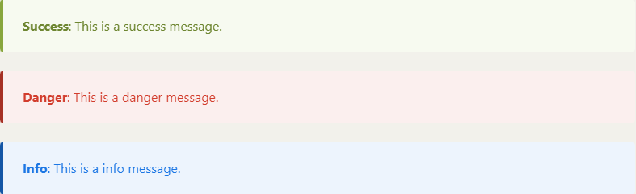

# GEP#0 : Grapp Enhancement Proposals

__Author(s)__ : RSZ
__Start date__ : 19/08/2021
__Last Modification__ : 15/10/2021
__Type Key__ : X
__Status Key__ : A

----------------------

## Introduction

This document defines and provides the procedure of edition for Grapp Enhancement Proposals.

## Guidelines

GEPs are open discussions, specifications and documentation about the Grapp Project. They are intended for all users, end-users, contributors and members who want to know more about Grapp.

Anyone interested to participate in the project is invited to contribute directly by making pull requests on the GEP(s) repository or discuss modification, interpretation, implementation directly by opening or replying to an issue on behalf of the GEP.

The key words "MUST", "MUST NOT", "REQUIRED", "SHALL", "SHALL NOT", "SHOULD", "SHOULD NOT", "RECOMMENDED",  "MAY", and "OPTIONAL" used in the GEPs are to be interpreted and used as describe in the [RFC2119](https://datatracker.ietf.org/doc/html/rfc2119).

### Definition

GEP(s) is an acronym for Grapp Enhancement Proposals. GEPs are part of the mandatory documentation and contribution procedure for the grapp libraries and softwares. This format largely inspired by [PEPs](https://www.python.org/dev/peps/) for Python. 

### Repositories

Offfical repository for GEP(s) as stated in [GEP#12](./gep-12.md) is : [https://github.com/grapp-project/geps](https://github.com/grapp-project/geps).

### GEP Number

The number GEP is at the choice of editors. Only positive value are accepted. However, you must verify that it is not already used nor reserved. You cannot choose a number already present in the [GEP list](./gep-1.md), even for obsolete, rejected or canceled GEP(s). Once the number is chosen and pushed, it is no longer editable.

### GEP Title

The titles of the GEPs should be short, meaningful and descriptive (>60 characters may be considered a bit long). The title should be in line with the content. Several GEPs could have the same name, especially if one were to cancel or render obsolete another. It is not recommended to put a version number or any other designator that will be changed in the title. Iitles remain editable until their final version.

### GEP Types key

| Key | Type |
|-|-|
| I | Informational GEP |
| X | Process GEP |
| E | Feature request or implementation GEP |
| S | Security or Standards relative GEP |

### GEP Status key

| Key | Status | Description | Editable |
|-|-|-|-|
| A | Accepted or Active GEP | Editing is open to all, this document is considered as a work in progress and requires reviews. | Yes |
| D | Draft or Provisional GEP | Its content is considered incomplete and the author(s) is designated as the sole editor of its content. | Only by its author(s) |
| C | Canceled GEP | The content is not eligible for a final version or is no longer active but may be useful for future GEP(s). | Only for his status |
| O | Obsolete / out-of-date GEP | Its content refers to an earlier version that has been replaced by other GEP(s). | No |
| R | Rejected GEP | The content has been rejected by its original author(s) or by the community, its content is considered unnecessary to keep. | No |
| F | Final GEP | The content is a final valid version, it has undergone a sufficient review process and is approved by the community. | Only for his status / translations |

### GEP Process

This process is designed to create continuous improvement. In fact, the only possible outcome for a final version is its obsoleteness. That is to say, to be replaced by a new GEP(s) or standard which renders this first (final and approved) version obsolete and redefines its content. Obsolecence is therefore not seen as a negative end but rather as a way forward.


It is possible to change the status of GEPs in two main ways:
- Unilateral, the choice's of the author(s):
	+ Does not need to be argued and is left free.
- or collective, must be subject to a community approval:
	+ Must be argued
	+ Must have a sufficient number of reviews to be approved
	+ Must be sourced from process(es) that have been defined in an active or final GEP(s)

In this second case, the pull request that is the subject of the status change will act as a place for debate and vote.

A type A GEP which has not been modified, nor active anymore for more than 3 months should be returned to original author(s) for modifications in Draft or Provisional GEP (D).

A type D GEP which has not been modified for more than 3 months should be Canceled (C).

These durations are arbitrary within the project, are made in order to impose a rhythm within the project and also allows to give an indicator to the readers of the continuity of a paper.

When a GEP is in Accepted or Active (A) status, a contributor can request that it be upgraded to final status. This Final status (F) should "set in stone" the GEP, no modification will be possible except changing the status to "Obsolete or Out-of-date" (O) and replacing this GEP by a new one. To do so, the contributor must open a question or a pull request indicating the change of status. This will act as a place of debate and vote. A special "final_call" label is dedicated to this.

> At the moment, there is not enough contributors to move any GEP to a Final status.

### GEP Syntax

The document must be written in [GitHub Flavored Markdown](https://github.github.com/gfm/) (with tables extension).

What is not accepted :
- Inline HTML
- External Image(s) or asset(s), see __Posting assets__ below
- External link(s) with the exception of that only allow you to source the document or define a standard
- Broken link(s)
- Markdown comment, all comments on documents must be provided through an issue via Github

What can be accepted :
- Statics [Mermaid diagrams](https://mermaid-js.github.io/mermaid/#/), without [Interaction](https://mermaid-js.github.io/mermaid/#/classDiagram?id=interaction), [custom styling](https://mermaid-js.github.io/mermaid/#/classDiagram?id=styling) nor externals images as stated above
- [Standard Unicode Emoji 😎🍇](https://unicode.org/emoji/charts/full-emoji-list.html), should be used sparingly or should have real utility

#### Alert messages

Personalised messages can be used sparingly. These messages benefit from increased visibility on the website. However, they must contain an internal title so that they are also understandable in pure markdown format. 

These messages are formatted as follows:

To write a __warning message__, write a code quote in markdown specifying `md_warning` as the code highlighting info :

```markdown
	```md_warning
	__Warning__: This is a warning message.
	```
```

Will print the following on the website :


Other type of customized message are available :
- __Success__ message, with `md_success`
- __Danger__ message, with `md_danger`
- __Info__ message, with `md_info`

In order, these messages render the following on the website :



You can also add a title to these message types by specifying it behind a colon `md_warning:My title`.

__Example__ :

```markdown
	```md_info:This is a titled info
	__Info__: My awesome info.
	```
```


### GEP Header

Each GEP contain an header with some important metadata which can be used to render them on a website and to index them more easily. This header has the following form in markdown :

```markdown
# GEP# : 

__Author(s)__ : 
__Start date__ : 
__Last Modification__ : 
__Type Key__ : 
__Status Key__ : 

----------------------
```

- You should set your GEP number after the sharp character and specify a short, meaningful and descriptive title after the colon.
- The `Author(s)` field should specify username or complete name of all authors participing in the edition and in the modification of the current GEP. It should be seperated by a comma and a space `, ` and listed in alphabetical order (_e-g_ `Alice, Bob, Foo Bar`).
- The `Start date` field is the date corresponding of the first commit of the GEP. Date's format is `DD/MM/YYYY`.
- The `Last Modification` field is the date corresponding of the last commit of the GEP and should be updated on each modification.  Date's format is `DD/MM/YYYY`.
- The `Type Key` field corresponding to the type of the GEP (see above, __GEP Types Key__).
- The `Status Key` field corresponding to the status of the GEP (see above, __GEP Status Key__), if it's a first post, the default value is `A` for Accepted or Active GEP if the GEP is still in the editing state, you can even publish it so please set `D` for Draft.

### GEP sections

- Each GEP should have a first section named `Introduction`, this part should be a very terse and human-readable version of the of the overall content of the document.
- Each title after the Introduction should be at least of level 2 (`##` in Markdown).
- All Type E (__Feature request or implementation GEP__) can't be added , as active, with an empty or incomplete section (See [GEP#999: GEP Template - Type E](./gep-999.md) for more information) :
  - _Use Cases_
  - _Specification_
  - _Backwards Compatibility_
  - _Test Cases_
  - nor _Security considerations_ section.
- You are totally free to add the sections and sub-sections, except for these followings types of GEP where the sections have been standardised :
	- A __Communication action GEP (type I)__  must have completed sections as stated in [GEP#11](./gep-11.md) (see "Communication action").
	- A __Security Bulletin GEP (type S)__ must have completed sections as stated in [GEP#31](./gep-31.md) (see "Mandatory sections").
- Each GEP finish by the license section :

```markdown
## License

- [CC BY 4.0](https://creativecommons.org/licenses/by/4.0/)
```

### GEP Templates

To help you in writing your first GEP, here are some templates corresponding to the different possible types :
- Template for Feature request or implementation GEP : [GEP#999 : GEP Template, Type E](./gep-999.md) 
- Template for Process, Informational, Security or Standards relative GEP : [GEP#998 : GEP Template, Type I, P and S](./gep-998.md) 

Specials GEP:
- Template for Communication Action : [GEP#996 : GEP Template - Security Bulletins](./gep-996.md)
- Template for Security Bulletins : [GEP#997 : GEP Template - Communication Action](./gep-997.md)

### Posting or modifying GEP

Once you have written your GEP you should provide it on the main GEP repository with your GitHub account. You should provide it by sending a pull request to the main GEP repository. You should put your file at the root, the filename must be `gep-X.md` where X is the choosen number of GEP without `0` padding (_e-g_ `gep-0.md` for this one, `gep-00.md` is forbidden).

You must provide a commit title and short description :
- the title of the commit should be like `GEP X: Title`, where `X` is the number of GEP and `Title` is a short title for creation or a short title of the modification.
- and a short description relative to the GEP creation or modification.
- if you edit multiple GEPs, you can specify this by separating them with commas (_e-g_ `GEP 0,1 : Definitions and index for GEPs`)

#### Posting assets

To enhance the texts and your explanations you can attach some files to your GEP. You should commit it in the main GEP repository in the `/assets/gep-X` directories, where X is is the choosen number of GEP. Files must be named in a consistent way according to the guidelines below :

- Use only lowercase letters (a to z), numerals (0 to 9), hyphens (-) and underscores (_).
- Do not use special characters (e.g. é, è, ê, ï, õ, ù) or other punctuation marks.
- Do not use spaces. Instead, use underscores in place of spaces to delimit words.
- Do not include dates or version numbers in filenames.
- Filenames must be short, meaningful and descriptive.
- Only assets in the following formats are allowed :
  - Markdown file(s), `.md`, if the document is too large to reasonably be included in one file.
  - Images files, only `.png`, `.jpeg` and `.gif` are allowed.

### Reserve a number

To reserve a number you must modify the [GEP#1](./gep-1.md) that contains the list of reserved numbers. You must to justify this reservation by indicating its author, its title or a (very) short summary. A number reserved for more than 6 months must be released.

### Versionning

The GEP(s) do not have any versions as such. Each GEP is identified by its number, commit number, GEP keys and title. GEP(s) should not contain any other identifiers than these.

### Internationalization

The GEPs are documents provided in __English only__.

Wherever possible, translations could be made. However, as GEPs are dynamic and evolving documents it would require resources and active contributors to keep the translations up to date. Any changes to a GEP would render the translation partially invalid until it is also updated. In order to avoid incomplete translations or translations that may not be viable in a near future, translations may only be provided as a guide when a GEP is in status F (Final).

These translations should then be provided as Markdown files as assets (see "Posting or modifying GEP" > "Posting assets" above) and specified in the original GEP in a __Available translations__ section just below the Introduction section.

### Obsolete/Canceled GEP

An obsolete EPG must be edited and specified after the `Introduction` section in an `Obsolete` section. The replacement GEP(s) or new standard must be cited.

_E-g_
```markdown
# Introduction

[...]

# Obsolete [/ Out-of-date]

This GEP is OBSOLETE [/ OUT-OF-DATE]. Please refer to the new GEP which remplaces it :
- (GEP#XX)[./gep-x.md]
- (GEP#XX)[./gep-x.md]
- (GEP#XXX)[./gep-x.md]
```

### Inappropriate content

Any content that does not comply with the [code of conduct](./gep-41.md), a license agreement, or that does not respect moral rights or intellectual property rights must be rejected.

If however, by mistake, an inappropriate content pass the contribution process or if you think that a content of the site belongs to you or infringes intellectual property rights, you should contact us to have this content removed as soon as possible. Similarly, if you notice any abnormal/immoral/offensive/whatever content, please contact us immediately to have it removed or modified as soon as possible. Specify the document(s) in question so that we can remove them and act as quickly as possible. Either by opening an issue, or by sending an e-mail at: contact@grapp-project.org. 

### License & Attribution

The GEP(s) are distributed under a [CC BY 4.0](https://creativecommons.org/licenses/by/4.0/) license. This should be specified, by default, at the bottom of the document in the "License" section.

As a contributor, you must to publish original only and you agree that all resources provided are attached to this license. If, however, you should publish a resource that requires attribution, you must specify this directly on the relevant GEP in an `Attribution` section by mentioning the resource concerned and related rights.

## See also

- [GEP#1](./gep-1.md) : the full list of GEPs

## License

- [CC BY 4.0](https://creativecommons.org/licenses/by/4.0/)

