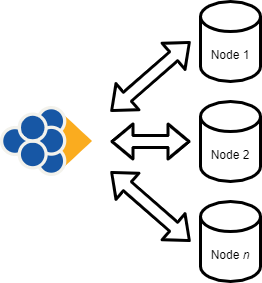
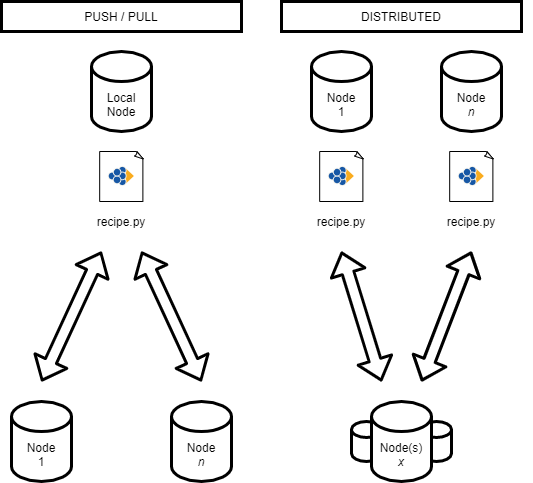

# GEP#2 : Motivation

__Author(s)__ : RSZ
__Start date__ : 15/09/2021
__Last Modification__ : 15/09/2021
__Type Key__ : I
__Status Key__ : A

----------------------

## Introduction

The main reasons and conviction of the project.

## Statement

It may be necessary to remind that the current trend is the era of digitalisation (also known as the "internet bubble").

In this movement, every company has a duty to adapt, to transform their processes and to comply with these new standards. This is becoming more and more important every year and has accelerated recently and inevitably with the COVID crisis and the advent of teleworking. This is costly, especially for small organisations whose activities are not related to this field.

One of the results, which may be negative, is that some companies, especially the web giants and mostly privately owned, are taking advantage of their position,
These companies then want to impose a model and a set of rules on their customers that they can't afford to ignore. These companies then wish to impose a model and aim for centralisation which  are very profitable for them. However, there are alternatives that are much less expensive, more ecological, more responsible and more local. 

This project is part of the conviction that the free and open source model is a fascinating force and that the alternatives must be increasingly accessible.

Indeed, all the tools made available and which are today in the public domain are real mines of knowledge and are already profitable for all at zero cost!
It seems important to point out that the web giants are also happily taking advantage of this model (e.g. all the services that are based on Linux systems).

The present tool aims to decentralise a growing power that can be financially overwhelming for companies in their management of their IT infrastructure by offering an alternative based on solid, free, open source and already recognised systems and protocols (GNU/Linux, OpenSSL, SSH). The aim is to allow companies to maximise the budget allocated to innovation rather than paying more and more for solutions that are already "fat" and amortised. And sometimes, totally inconsistent with the real needs of the company.

## Free and Open-Source

Free and open-source software and protocols, because of their openness to the public promote cooperation, innovation, sharing, transparency, knowledge, the debate and discussion, can avoid certain losses of energy and minimize costs.

In order for the software to be accessible to everyone, it is distributed totally __free__. Also so that everyone can understand, improve, modify, it is distributed in __open-source__ and is provided with the most complete documentation possible.

You can find many projects and service providers that offer (free) software but, through a mercantile mechanism, can lock you into a proprietary environment that limits your rights, powers and/or are finaly expensive, which can limit your ability to innovate and restrict your freedom. Many proprietary and hosting companies offer services and force you to use opaque technologies that can make you financialy dependent on their products. These solutions allow rapid scaling but take away the sovereignty and control of the user. These same companies will sell you certifications to use their products because they are selling treacherous complexity and because their products are complex. Moreover, this will allow them in the future to make you sell for them or buy their products. This seems unacceptable when the Internet is a tool for sharing and "almost free" access to knowledge. The ease of access, sharing and understanding encourages technological innovation.

Some of the solutions comparable to this philosophy use non-appropriate architectures that ultimately provide proprietary and include software elements that (unilaterally) abstract the choice, which should be yours, to use a provider rather than another. This contributes to a knowledge leakage to powerful companies. However, we have all the means, the knowledge and ability to share this knowledge and provide it free of charge to other users. Grapp want to provide an alternative to democratise a non-proprietary approach. Because it is above all the user who creates the added value - the ability to manage applications and infrastructure does not only belong to the web giants, it belongs primarily to the users. This project is a free and open source software and specifications which aims to give power and rights back to users and unleash their capacity to innovate.

In this sense, Grapp is an attempt to contribute to a more free and open eco-system by promoting the use of public protocols and software.

## IaC ("Infrastructure as Code") and Automation Framework

The rise of virtual machines and cloud computing has seen the arrival of many new ways to deal with computing resources. And here is a new one.

"Infrastructure as code" is a way to transpose physical or virtual elements (the infrastructure) directly into variables on a program. Using these techniques it is now possible to abstract environments and this facilitate the management of complex infrastructures. It helps to erase the barriers between the design of applications and the design of the environments in which these applications run.

The main objective of Grapp is to provide an interface, accessible to the largest number of people, which facilitates the management of computing ressources on a small or a large scale. Grapp leaves the full access to the user (owner) and let him to be responsible of his infrastructure without hindering his rights, powers nor imposing him restrictions or products.

It is unthinkable to use Grapp in a production context currently. Grapp is not a mature project if you want to use a tool in a production environnement we advise you to turn to others solutions.

Many serious and advanced projects exists on the subject. The following list is not intended to be exhaustive nor to particularly promote one projet more than other:
- Ansible
- AWS Cloudformation
- Azure Resource Manager
- Chef
- Google Cloud Deployment Manager
- Kubernetes
- Puppet
- (r)?ex
- Saltstack
- Terraform
- Vagrant

Grapp is not intended to resemble or replace any other project in this domain. Also, Grapp is not intended to be revolutionary but to facilitate the existing. He stands out by gathering the following properties :

Grapp is :
- A __pure__ Python IaC ("Infrastructure as Code") and automation framework
- providing three main __independant__ interfaces:
	- a Python API as a package
	- a command line interface (CLI)
	- a web console (UI)
- An intuitive and lightweight solution, as easy to use and unsderstand as possible
- Open source and specifications, documented and based on use cases.

Grapp does not :
- use an architecture with a master node.
- force the user to choose a pull or push approach.
- initially need dependencies on remote nodes.
- have configuration files for application deployment.

## Architecture

Grapp is a framework that integrates remote connection interfaces. It does not directly induce the end user to use one architecture rather than another. Initially, Grapp does not need to include any dependencies on the target machine(s) it wishes to connect to except Python on local node and SSH server on the target. It performs its actions via a simple SSH connection or, locally, via the methods of the standard Python libraries. The target machines are called "Node(s)" and can be abstracted.

And that's about it, Grapp is quite permissive in its use.

To carry out his tasks, the end-user creates what are known in the project as "recipes". These recipes are simple Python files or projects that abstract a mechanism that the user wishes to describe. These can be :
- An installation recipe, which will install on one or more machines
- A deployment recipe for an application
- A security check automation recipe
- A recipe for automating software tests
- ... Or a mix of all the above. As much as possible, examples of use cases will be published to guide the end-user in its use.

The nodes declared in the recipes can either correspond to real resources in the end-user's environment or correspond to an abstraction of these resources, which subsequently allows an other user to adapt the recipe for his infrastructure. Grapp provides interfaces to abstract these resources and to manage access to them. If they do not contain sensitive information or a mechanism that the end-user would like to protect to, these recipes can be shared and/or duplicated between team members, even publicly or served behind a web API.

By providing a framework, Grapp gives the user the choice of using a "Pull" or "Push" or "Distributed" approach. If the right mechanisms and protocols are included in the recipes, we could even imagine using Grapp to provide IT ressources and/or services in a centralised or even in a decentralised environment.

Things to remember about this:
- The end user evolves and uses Grapp in his own environment (LAN/WAN).
- His infrastructure is composed of a local node (his PC) and remote server(s) called here "node(s)".
- Grapp interfaces the connection to remote servers and provides a Python API that allows it to compose useful "recipes" to manage its infrastructure.

## About Security

Security is above all a discipline, the use of mechanisms, methodologies and rigour. Computer security and cryptography are arts. Grapp will never claim to be secure, because even if the tool could bring security with its interfaces and by promoting the use of good methods, it is above all its use - how it is used, in which context, environment, who manipulates it - that is really important. 

The first priority in the development are the security considerations induced and necessary to any IT infrastructure and business exercise. Grapp is intended to uses, promotes, redistributes interfaces and all best practices in terms of security. All these considerations imply that the versions made public must have the necessary reviews and respect a set of rules compatible with a certain level of security, induced or sought by the end user. Everything must be designed so that the end user can judge, understand and justify of a certain level of security. All documentation relating to security considerations is publicly available and is maintained in the main GEP repository.

## Why Python ?

For many reasons Grapp is primarily written in Python. 

Mainly for the following reasons :
- its age
- its accessible syntax
- its optimization
- its portability
- its package system
- its power and speed
- its active community and eco-system and all the available tools created by it
- its emergence in the fields of data science

All this participates to make it a fabulous language. Python is also one of the most used languages today and the most in demand. Even if it seems to be most appropriate in the fields of IoT, machine learning and data science, this language is quite suitable for web (server-side) and back-end implementation.

## Why "Grapp"

- Because a project must have a name.
- Because it is short (and therefore easy to remember and easy to type in a terminal).

And for other reasons :

- Because it is literally close to "grappe" in french, this is what links the grapes and we can compare it to a cluster of nodes (computer resources), which suits well to the project. If this don't make coffee, this makes good wine.
- Because it is literally close to "grab" in english and this word makes sense for the user who wants to access / push / manage his applications and computer ressources.
- Because it also contains the word "app" (gr-app) what it makes sense in the deployment of applications.

## See also

- [GEP#18: Licenses](./gep-18.md)
- [GEP#3: Security Consideration](./gep-3.md)
- [GEP#21: Proof of Concept](./gep-21.md)

- Some source, more or less viable in the sense that there will always be tops who will put forward other languages, these are given as an indication :
	- _[Most used programming languages among developers worldwide, as of 2021, statista.com](https://www.statista.com/statistics/793628/worldwide-developer-survey-most-used-languages/)_
	- _[11 Most In-Demand Programming Languages in 2021, Berkeley Extension](https://bootcamp.berkeley.edu/blog/most-in-demand-programming-languages/)_
	- _[Most popular programming languages, Northeastern](https://www.northeastern.edu/graduate/blog/most-popular-programming-languages/)_

## License

- [CC BY 4.0](https://creativecommons.org/licenses/by/4.0/)
