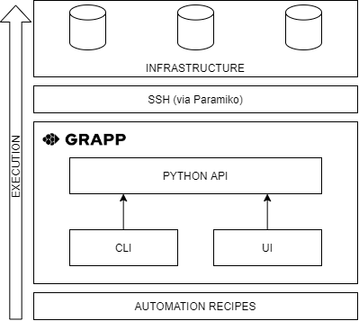

# GEP#21 : Proof of Concept

__Author(s)__ : RSZ
__Start date__ : 13/09/2021
__Last Modification__ : 15/10/2021
__Type Key__ : E
__Status Key__ : D

----------------------

## Introduction

This document describes the first implementation of Grapp as a proof of concept.

## Use Cases

This first version will allow the end user's to deploy an example application available on Github into a Debian or Ubuntu Server.

## Objectives

The objective of this proof of concept (PoC) is to provide a first, very simple interface that allows the deployment of an example application. It allows the first visitors, contributors to have a first example of how the software works.

In order to be able to demonstrate the feasibility of the project and how it would take shape, this proof-of-concept must include some of the project's key features. The interface will therefore be incomplete as it is only based on a single use case.

Functional objectives :
- Execution of remote commands via SSH
- This first test will work perfectly on two target OS : Debian and Ubuntu Server.
- Abstracting the hosting server into Python code
- Deploy the [beauty-vuejs-boilerplate](https://github.com/zmts/beauty-vuejs-boilerplate) application on a remote "cold-start" server via a shareable "Recipe" (see definition below):
	+ Install needed dependancies : `git, python, pip, iptables, nodejs`
	+ Clone the repository on the remote host
	+ Add iptables rules restricting access to all ports other than those needed
 	+ Build and/or launch the application remotly

The other objectives of this implementation are :
- The architectural basis of the project must be present and example of lines of working code must be provided.
- This first draft will be publicly available on Pypi to reserve the name of the future package and to provide a first example of implementations.
- Provide a publicly postable "recipe" validating the above points.
- All documentation should be provided and publicly available to guide the end user in its use.

## Prerequisites

- A local node, connected to the internet, Python (>=3.6) and pip should be installed.
- A remote node, also connected to the internet, with :
	- Debian or Ubuntu Server
	- SSH server
	- a user with sudo rights (for iptables)
	
### Some details on the choices

As stated on [PEP 373](https://www.python.org/dev/peps/pep-0373/), Python 2.7 is no longer supported, this is why this implementation should working the lastest Python supported version (>= 3.6 at the time of writing).

You can see that two choices have already been made that could restrict the use of the package :
- An SSH server is required
- Debian or Ubuntu Server was chosen as the target OS

In order to be absolutely clear about these specificities, I have to argue them.

__SSH__: Grapp is first and foremost a tool that works via an SSH connection, which obviously includes having a host that responds and therefore a SSH server with a connection already configured. This is quite understandable as most hosting companies provide (de facto) an SSH connection when you buy a VPS or dedicated server hosting service. Also, you can download containers (typically [via docker](https://hub.docker.com/r/krlmlr/debian-ssh) that directly offer you an open SSH connection. Otherwise, when you install your server (e-g [Installation of a SSH server for Debian](https://wiki.debian.org/SSH#Installation_of_the_server)) or even for a [Raspberry](https://www.raspberrypi.com/documentation/computers/remote-access.html#ssh), it is a very simple configuration to do during installation. This article is not intended to teach you how to set up an SSH server, but you should know that it is a prerequisite that is a very affordable and popular technique. The configuration and automation of SSH configuration will be the subject of other dedicated papers.

__Debian / Ubuntu Server__ : These two target operating systems are among the Linux distributions that appear to be most widely used as servers in (as stated in [W3Techs](https://w3techs.com/technologies/details/os-linux) and [security space](https://secure1.securityspace.com/s_survey/data/man.202109/apacheos.html)). These operating systems are widely available from hosting providers. Also it seems to be a future choice because they are [proven systems](https://wiki.debian.org/DebianReleases) or integrate a [LTS](https://wiki.ubuntu.com/LTS). This choice is also in perfect adequacy with the philosophy of the project which is to promote free and open source systems and softwares and the development effort must be directed towards these solutions. It is absolutly not excluded here that other OSs will be supported, it is here a question of testing the PoC on two different systems in order to provide an initial architecture that integrates the differences between these two systems.

## Specification

This document can be referred to as the "PoC Specification 0.1.0", "PoC Version", "PoC" or "0.1.0".

### Release version

This first fully compatible version of this specification will be __0.1.0__. 
- No other version will be accepted for this minor version (0.1).
- Any version below this one are considered as incomplete, are partial code.
- Any lesser version in development will iterate on the patch version and its appendix.
- This version will not be made into a "stable" release. Further specifications and a full review process must be put in place before that.
- All recommendations in this regard should be made so as not to mislead the end user.

As stated in [GEP#4](./gep-4.md) (Branches and Versions > Grapp Package), candidate versions for this first implementation should be marked 0.1.0-rc.X. All versions must be pushed to the main repository in their respective branches. Any pull requests that do not comply with this specification while it is not invalidated by another specification should be aborted.

### Definitions

#### End-user

The end user is the user who uses a distribution of Grapp.

#### Environnment

The environment is specific to each user. "Environment" as understood in this specification is an abstraction of the end-user environment. Each user can compose and rewrite their own environment via this abstraction and include their own compatibility or security mechanisms.

#### Node

A Node is an abstraction of a host, it runs Linux and may be SSH reliable. It provides all the services that a Linux can host. This node is not necessarily available at the moment but may represent a future or no longer available host.

#### Recipe

A Recipe is a project that uses the Grapp package. The recipes are written in Python and use the components abstracted by the library. They are written by the end users and contributors.

For any application intended for the public, the recipe must not contain anything that would cross the courtesy limit. In this sense, all public-facing recipes must not contain any indication of any login, password, port or configuration that, if uncovered, would be a vulnerability. All so-called sensitive variables must be abstract, clearly identifiable and modifiable by the end user in the recipe process.

### Main architecture



Grapp is distributed via a single package on Pypi. This includes and provides three main interfaces :

- __Python API (Core)__ : This expose the internal functions, in an organised manner, to enable developers of recipes to access the features described below.
- __CLI__ : It provides the functionality described below based on the Python API. It allows system administrators to easily access and manage  remote resources.
- __Web Console (UI)__ : It also provides the functionality described below based on the Python API. It allows less advanced users, or those without a terminal, to have visual feedback and a terminal directly on a local web page.

```md_warning
__Important__ : Web Console (UI) will not be described in this specification but will be the subject of a seperate document and should be considered in the present.

The focused release must implement the basics of the first two components (Core and CLI), the UI should not be included in this release. However, the architecture must already include the _design_ of the UI.
```

### Features

- (__NOT PUBLISHED DRAFT__) GEP#200: Remote Command Execution
- (__NOT PUBLISHED DRAFT__) GEP#210: Infrastructure as code
- (__NOT PUBLISHED DRAFT__) GEP#220: Recipes

These first three features lay the foundation for future implementations. Indeed, with these three features, it will be enough to achieve a solution to the objectives set above. However, it seems obvious that we can simplify further and provide other interfaces that allow the same result in a simpler way. The objective is to allow the developer to deal with a Python interface mainly and not with unix commands which may be specific to each OS. Future functionalities should be oriented in this direction.

### PoC Example(s) Recipe(s)

It must be included in the README, a repository containing example of recipe(s) corresponding to the implementation with all the documentation necessary for its proper understanding.

## Backwards Compatibility

- No backwards compatibility, 0.X.X is not considered a major release.
- Present specifications will determine the compatibility with the first minor versions (0.1.X). Any patch version noted 0.1.X should be compatible with this one, patch this first one and comply with the present specification.
- Any further version (>0.1) or feature that made this first one incompatible should have complete specification which makes this one obsolete and must be released above.
- This version is intended to be a reworkable and improvable basis for the future specifications of the first major version 1.0.0. Any intermediate version not compatible with this first version (>0.1 and <1.0.0) will iterate on the minor version until the first major version is agreed.

## Test Cases

Please ensure you have read the corresponding sections relative to test cases in :
- (__NOT PUBLISHED DRAFT__) GEP#200: Remote Command Execution
- (__NOT PUBLISHED DRAFT__) GEP#210: Infrastructure as code
- (__NOT PUBLISHED DRAFT__) GEP#220: Recipes

## Security consideration


Please ensure you have read the corresponding sections relative to security consideration in :
- (__NOT PUBLISHED DRAFT__) GEP#200: Remote Command Execution
- (__NOT PUBLISHED DRAFT__) GEP#210: Infrastructure as code
- (__NOT PUBLISHED DRAFT__) GEP#220: Recipes

### Version Recommendations

As stated in [GEP#3](./gep-3.md), all the recommendation about security should be made in visible manner. They must be included directly on the README and may be printed during code execution. Recommendations for the version 0.1.X are the followings :

- __It is strongly recommended not to use__ if you don't know what you are doing or without checking the content of the code first. This version could lead to __real and critical vulnerabilities__ on your computer and/or your host.
- This version is a proof-of-concept, possibly partial, it not be intended for any use in any production environment or context but for testings and development only.
- This version has not enougth reviews to ensure a proper and secure methodology of development.
- You must ensure that you have an up-to-date version of the code.

## License

- [CC BY 4.0](https://creativecommons.org/licenses/by/4.0/)